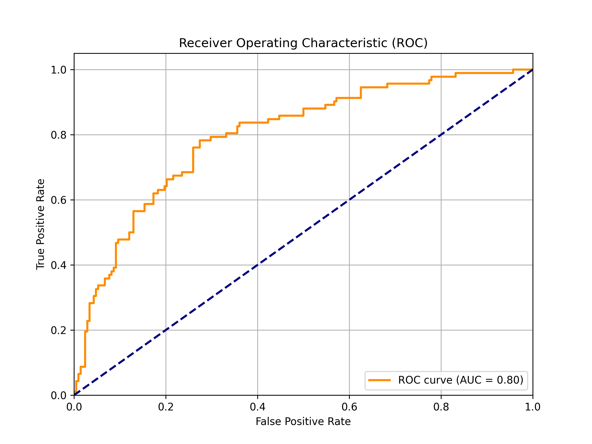

# 🏦 Credit Risk Scoring Model (銀行信用風險評分模型)

## 📖 專案背景 (Executive Summary)
本專案旨在模擬銀行內部的**信用評分卡 (Credit Scorecard)** 開發流程。利用 **German Credit Data** 建立機器學習模型，預測客戶的違約機率 (Probability of Default, PD)。

本專案選用銀行風控最通用的 **Logistic Regression (邏輯斯迴歸)**，重點在於符合監管要求（如 Basel III）的**可解釋性**與**穩健性**。透過統計方法量化風險因子，協助銀行在「擴大放貸」與「控制呆帳」之間取得最佳平衡。

## 📊 數據集與技術 (Dataset & Methodology)
* **數據來源**：[Kaggle - German Credit Data]
* **樣本數**：1,000 筆 (700 筆正常 / 300 筆違約)
* **核心技術棧**：
    * **數據清洗**：異常值處理(1%-99% Winsorization)、缺失值填補。
    * **特徵工程**：處理類別變數、數據標準化。
    * **建模演算法**：Logistic Regression 。
    * **驗證方法**：5-Fold Cross Validation (五折交叉驗證)。

---

## 📈 模型成效分析 (Model Performance)

### 1. ROC 曲線與 AUC 指標

* **AUC Score: 0.7982**
* **數值意義**：
    * AUC 代表模型區分好壞客戶的能力。**0.7988** 的分數意味著：如果隨機挑選一位「違約客戶」和一位「正常客戶」，模型有 **79.8%** 的機率會正確給予違約客戶較高的風險分數。
    * 在實務中，AUC > 0.7 通常被視為具備上線水準，本模型接近 0.8。

### 2. 穩健性檢定 (Robustness Check)
簡單的測試集，5-Fold Cross Validation：
* **平均 AUC**：**0.7502**
* **標準差**：0.0580
* **解讀**：模型在不同數據切分下表現穩定，平均預測能力維持在 0.75 以上，證明模型具有良好的泛化能力 (Generalization)。

---

## 💡 勝算比分析 (Odds Ratio Interpretation)

透過將邏輯斯迴歸的係數 ($\beta$) 轉換為勝算比 (Odds Ratio, $OR = e^\beta$)，可以量化各特徵對風險的倍數影響。

> **計算公式**：$Odds Ratio = \exp(Coefficient)$
> * $OR > 1$：風險倍增因子 (Risk Driver)
> * $OR < 1$：風險保護因子 (Protective Factor)

### 關鍵風險因子分析表

| 變數名稱 (Feature) | 係數 ($\beta$) | 勝算比 (OR) | 商業解讀 (Business Insight) |
| :--- | :--- | :--- | :--- |
| **rate_4** (高分期付款佔比) | +0.45 | **1.57** | **風險增加 57%**。 分期付款佔收入比例最高 (>35%) 的族群，其違約勝算是低負擔族群的 1.57 倍。這顯示**現金流壓力**是違約主因。 |
| **hoehe** (貸款金額) | +0.42 | **1.52** | **風險增加 52%**。 每增加一個標準單位的貸款金額，違約風險提升 1.5 倍。大額貸款需搭配更嚴格的擔保品審核。 |
| **laufkont_4** (高餘額帳戶) | -0.83 | **0.43** | **風險下降 57%**。 支票帳戶餘額充足的客戶，其違約勝算僅為一般人的 0.43 倍。證明**流動性資產**是強力的保護因子。 |
| **sparkont_4** (高儲蓄) | -0.38 | **0.68** | **風險下降 32%**。 擁有高額儲蓄的客戶，違約風險顯著較低。 |

---
**Author**: Ping-Hsun Shen

**Contact**: 

